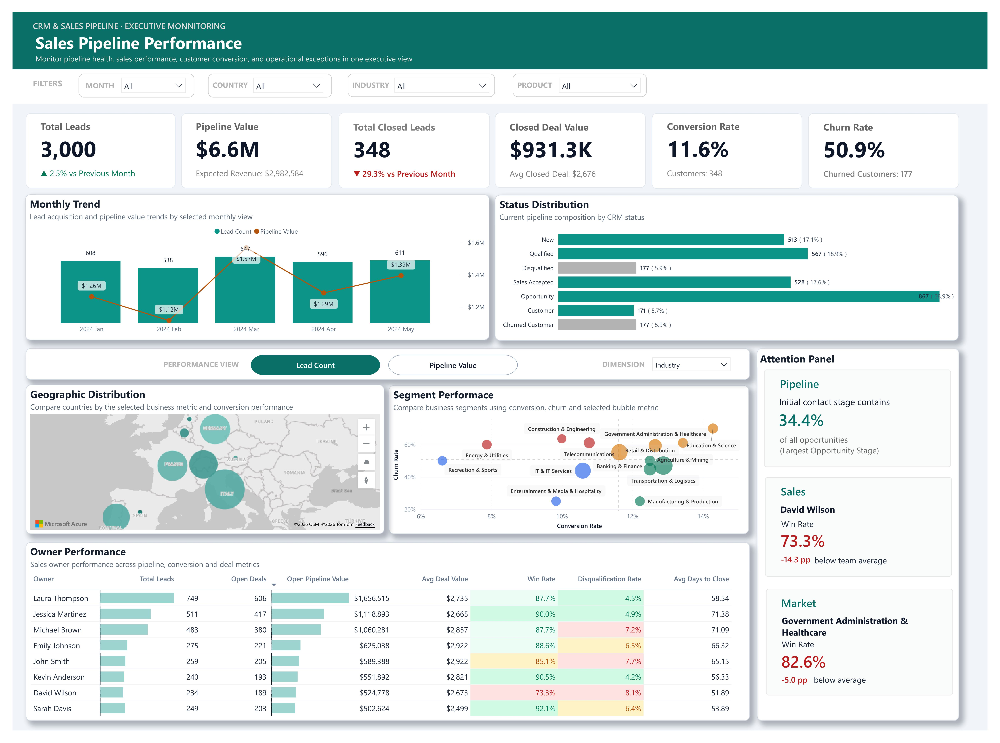

# 📈 CRM Sales Pipeline Performance Dashboard

A one-page executive Power BI dashboard designed to monitor CRM pipeline performance, evaluate sales execution, and identify operational issues across the sales pipeline.

The project transforms a CRM snapshot into a business monitoring solution by defining reliable sales metrics, validating business rules through exploratory analysis, and implementing an interactive dashboard for Sales Managers.

---

## 📊 Project Snapshot

|                     |                                                       |
| ------------------- | ----------------------------------------------------- |
| **Domain**          | CRM · Sales Operations                                |
| **Dataset**         | CRM & Sales Pipeline Dataset                          |
| **Scale**           | 3,000 Leads                                           |
| **Lead Period**     | Jan 2024 – Sep 2024*                                  |
| **Tools**           | Excel · Power BI                                      |
| **Focus**           | Sales Pipeline Monitoring · Executive Dashboard       |

**Some expected close dates extend into 2025.*

---

## 📈 Dashboard Preview

🔗 [View the live dashboard](https://lnkd.in/gNTDkxg9)



---

## 🎯 Business Context

Sales managers require timely visibility into pipeline performance, sales effectiveness, and customer outcomes to support operational decision-making. However, CRM snapshot data often contains structural limitations that can lead to misleading KPIs if business rules are not clearly defined.

This project develops a one-page executive dashboard that distinguishes pipeline health, sales execution, and customer retention while ensuring every KPI is supported by validated business logic.

The dashboard is designed to answer the following questions:

- What is the current health of the sales pipeline?
- How efficiently does the pipeline convert leads into customers?
- Which sales owners consistently outperform or underperform the team benchmark?
- Which business segments show the strongest or weakest sales performance?
- Which operational issues require immediate management attention?

---

## 💡 Key Insights

### 📊 Pipeline Health

The sales pipeline is heavily concentrated in the Opportunity stage, with Initial Contact representing the largest share of active opportunities. This indicates that moving qualified prospects into later sales stages is the primary operational bottleneck.

### 🎯 Sales Performance

Although the overall Win Rate is high once deals reach a final decision, the overall Conversion Rate remains relatively low, suggesting that many leads never progress far enough through the pipeline to become customers.

### 👥 Owner Performance

Sales performance varies noticeably across owners. After applying reliability thresholds, several owners consistently outperform the team benchmark, while others underperform with both lower Win Rates and higher Disqualification Rates, highlighting opportunities for coaching and process improvement.

### 🌍 Segment Performance

Performance differs more across Industries than across Products or Organization Sizes. Certain industries consistently achieve lower Win Rates and higher Churn Rates, making Industry the most informative dimension for monitoring sales performance.

### 🚩 Operational Priorities

The dashboard highlights the most important operational issues across the pipeline, sales team, and market segments, allowing managers to quickly identify bottlenecks, underperforming owners, and weak-performing business segments that require immediate attention.

---

## 🛠 Technical Highlights

- Built an end-to-end Business Intelligence workflow using **Excel** and **Power BI**.

- Cleaned and standardized CRM data using **Power Query**, including data type correction, category standardization, structural validation, and business-rule verification.

- Conducted exploratory data analysis (EDA) in Excel to validate KPI definitions, benchmark calculations, segment performance, and dashboard design decisions before implementation.

- Designed business metrics that distinguish **Conversion Rate**, **Win Rate**, **Churn Rate**, and **Disqualification Rate**, preventing common CRM reporting mistakes.

- Developed reusable DAX measures supporting executive KPI monitoring, dynamic segmentation, owner benchmarking, operational monitoring, and conditional formatting.

- Implemented an interactive one-page executive dashboard using bookmarks, Field Parameters, dynamic measures, and responsive visual interactions.

---

## 📂 Project Structure

```text
crm-sales-pipeline-dashboard/
│
├── dashboard/
│   └── crm-sales-pipeline-dashboard.pbix    # Power BI dashboard file
│
├── data/
│   └── data-raw.xlsx                        # Original CRM & Sales Pipeline dataset
│
├── docs/
│   └── crm-sales-pipeline-analysis.xlsx     # Analysis workbook (Power Query, EDA, KPI planning)
│
├── images/
│   └── dashboard-overview.png               # Screenshot of the final Power BI dashboard
│
├── README.md                                # Project overview, methodology, insights, and dashboard showcase
└── LICENSE                                  # MIT License
```

---

## 📌 Notes

- The dataset represents a **point-in-time CRM snapshot** rather than a transactional event log.
- Dashboard metrics are designed to respect the structural characteristics of the dataset while supporting reliable operational monitoring.
- KPI definitions and business rules were validated through exploratory analysis before implementation.
